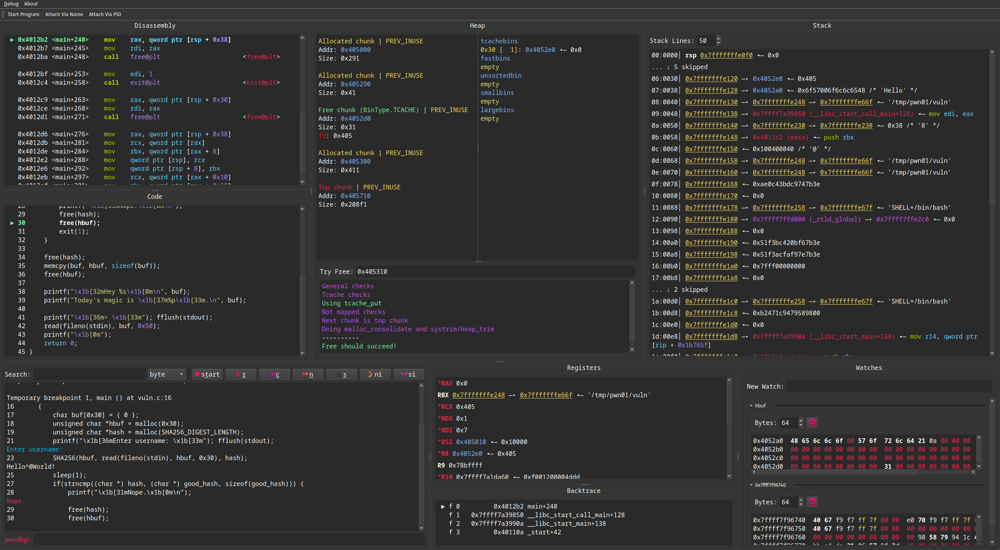

# pwndbg-gui 

An unofficial GUI wrapper around [pwndbg](https://github.com/pwndbg/pwndbg) intended to leverage the UI benefits of a graphical user interface.

## Setup

1. Install and setup [pwndbg](https://github.com/pwndbg/pwndbg#how)
2. Optionally add any settings you want in `~/.gdbinit`
3. Run `python start.py`
   - This will create a virtual environment and install the needed dependencies
   - On Debian/Ubuntu systems, you may need to previously install `python3-venv`
   - If you want to attach to running programs, GDB needs to be started with sudo. To do this, run `python start.py --sudo` and enter your sudo password when prompted

## Features

- Resizable and collapsible panes
- Heap context
  - Continuously show heap related information such as allocated chunks and freed bins
  - Give easy access to `pwndbg`'s `try_free` command
- Watch context
  - Add multiple addresses to a watch context to continuously monitor the data in a hexdump format
- Context menus for Stack and Register contexts, that allow easy lookup via the `xinfo` command.
- Keyboard shortcuts
  - Shortcuts for GDB commands as well as GUI features
  - Shortcuts are either displayed next to the action in a menu (e.g. `Ctrl + N`) or shown by an underlined letter (pressing `Alt + <LETTER>` will activate the button / menu)
- Input byte literals
  - When inputting to the inferior process (denoted by the label next to the main pane's input field) you can supply a python `bytes` literal
  - E.g.: Writing b"Hello\x00World\n" will interpret the input as a `bytes` literal and evaluate it accordingly
- All existing GDB / `pwndbg` commands can still be executed via the Main input widget

## Preview

## Motivation

`pwndbg` is a command line utility that greatly enhances `gdb` by allowing the user to more easily view data, as well as by adding many new commands.
As the dominant tools for debugging and pwning, they mostly suffer from the fact that they are bound to the limitations of terminal applications.
To address this we wanted to leverage a modern UI framework to wrap the most essential functionality.
This allows us to filter out, reorder and customize the gdb output, simplifying or highlighting important information.
Our GUI application primarily focuses on usability reducing the number of user commands, displaying information neatly, copying data easily, and providing hotkeys for control-flow.

## Approach

The GUI is written using the [Qt](https://doc.qt.io/qtforpython-6/) framework for python.
GDB is managed as a subprocess in [MI mode](https://ftp.gnu.org/old-gnu/Manuals/gdb/html_chapter/gdb_22.html) and interaction is handled by [pygdbmi](https://pypi.org/project/pygdbmi/).
To make the GUI more fluent and prevent hangups, the application is multithreaded.
The main thread is the GUI thread, which starts other threads that handle input to GDB (`GdbHandler`), collecting output from GDB (`GdbReader`) and interaction with the inferior process (`InferiorHandler`)

## Troubleshooting

- If you are experiencing issues on startup relating to QT plugins not being found or loaded try to set `QT_DEBUG_PLUGINS=1` and retry. This will show you more debug output related to QT. Most likely you will have some missing dependencies that can be installed via your favourite package manager. On Ubuntu/Debian it was the `libxcb-cursor0` library. See this [SO post](https://stackoverflow.com/questions/68036484/qt6-qt-qpa-plugin-could-not-load-the-qt-platform-plugin-xcb-in-even-thou).

## External dependencies
- [Qt PySide6](https://www.qt.io/download-open-source) as the GUI framework
- [Pygdbmi](https://github.com/cs01/pygdbmi) for interaction with GDB in MI mode
- [psutil](https://pypi.org/project/psutil/) for cross-platform access to process information

## Disclaimer 
This tool was developed as project for the Binary Exploitation practical course at TUM. All features are targeted to complete the pwning challenges during the course. If you like it, but have a use case that is currently not supported feel free to open a PR or an issue.  