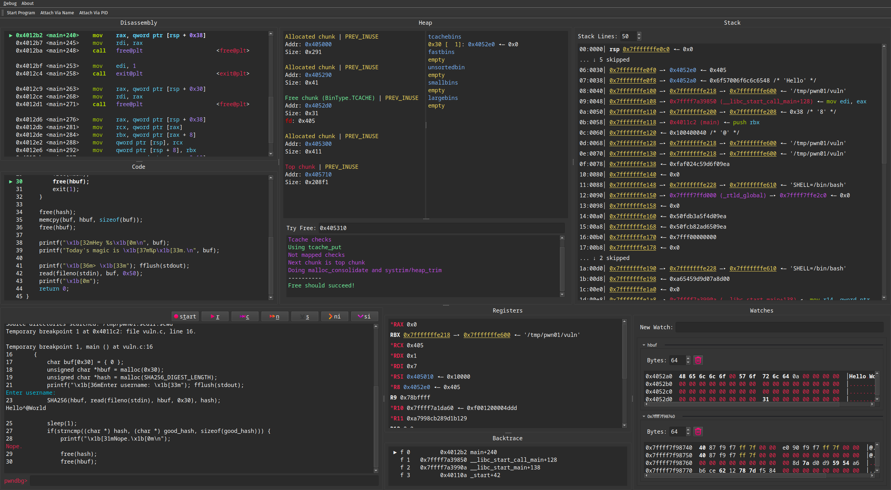

# Toolsubmission: pwndbg-gui

We built a GUI wrapper around [pwndbg](https://github.com/pwndbg/pwndbg) intended to leverage the UI benefits of a graphical user interface. It is available via the public [github repository](https://github.com/AlEscher/pwndbg-gui)

## Motivation

As stated in the proposal we identified multiple ideas to increase usability and approachability of `pwndbg` and `gdb`. As the dominant tools for debugging and pwning, they mostly suffer from the fact that they are bound to the limitations of terminal applications. To address this we wanted to leverage a modern UI framework to wrap the most essential functionality. This allows us to filter out, reorder and customize the gdb output, simplifying or highlighting important information. Our GUI application primarily focuses on usability reducing the number of user commands, displaying information neatly, copying data easily, and providing hotkeys for control-flow.    

## Approach

The GUI is written using the [Qt](https://doc.qt.io/qtforpython-6/) framework for Python. It is an open source framework that allows for easy implementation of custom widgets via inheritance. All our context widgets are tailored for the corresponding `pwndbg` context or custom context. 
All displayed information is received from GDB, which is managed as a subprocess in [MI mode](https://ftp.gnu.org/old-gnu/Manuals/gdb/html_chapter/gdb_22.html) and interaction is handled by [pygdbmi](https://pypi.org/project/pygdbmi/). The most important feature of `MI Mode` is the ability to assign tokens to commands. This allows us to filter output and send it to the corresponding widget. The context widgets are updated automatically on user interaction or program advancement.
To make the GUI more fluent and prevent hangups, the application is multithreaded. The threading logic is built on tools from the `Qt` framework which offers a powerful inter-thread communication with [Signal and Slots](https://doc.qt.io/qt-6/signalsandslots.html).
Our Application logic is split into three threads that handle different distinct tasks.
The main thread is the GUI thread, which starts other threads that handle input to GDB (`GdbHandler`), collecting output from GDB (`GdbReader`) and interacting with the inferior process (`InferiorHandler`).

## Features

- Resizable and collapsible panes
- Allows local executables as well as attaching to a running program (last requires --sudo)
- Buttons to control the inferior control flow
- Search functionality for different data types
- All default `pwndbg` contexts in a separate pane
- Context menus for Stack and Register contexts, that allow easy lookup via the `xinfo` command.
- Heap context
  - Continuously show heap-related information such as allocated chunks and freed bins
  - Give easy access to `pwndbg's` `try_free` command
- Watch context
  - Add multiple addresses to a watch context to continuously monitor the data in a hexdump format
  - Individually adjustable watch size 
- Keyboard shortcuts
  - Shortcuts for GDB commands as well as GUI features
  - Shortcuts are either displayed next to the action in a menu (e.g. `Ctrl + N`) or shown by an underlined letter (pressing `Alt + <LETTER>` will activate the button/menu)
- Input byte literals
  - When inputting to the inferior process (denoted by the label next to the main pane's input field) you can supply a Python `bytes` literal
  - E.g.: Writing b"Hello\x00World\n" will interpret the input as a `bytes` literal and evaluate it accordingly
- Splitter layout is saved when the application is reopened
- All existing GDB / `pwndbg` commands can still be executed via the Main input widget

## Preview

## How to use
The GUI is a wrapper for `GDB`. All functionality is based on its commands or custom commands `pwndbg` adds.

Since `GDB` is a terminal-based application with tons of use cases we didn't want to limit the user to a subset. Therefore we kept the basic prompt-style interaction as one of the widgets in our application. The bottom left widget is the so-called "Main" widget which lets the user interact with `GDB` the same way as with the terminal application. All `GDB` and `pwndbg` commands can be entered here in the bottom left input line. The corresponding output is shown in the box above. The same widget also allows for interaction with the debugged process. The "Main" widget also includes buttons for controlling the debugged process. These are just convenience for the usual gdb commands. Most of them additionally provide keyboard shortcuts via pressing `Alt + <LETTER>`. A search bar wraps the `pwndbg` search command that lets the user find data in memory.

The Disassembly, Code, Registers, Stack, and Backtrace widgets display the corresponding `pwndbg` contexts in scrollable panes. The lines of the Stack context can be adjusted via the spinbox in its header. The contexts all update automatically on every stop of the debugged process or user input command.

The Heap context is a custom-made context that is based on the `heap`, `bins`, and `try_free` commands of `pwndbg`. It shows the current chunk layout in the main arena and the bins. In the "Try Free" input the user can give an address to check if a free call on it would succeed.

The Watches context is a custom-made context that is based on the `hexdump` command of `pwndbg`. It can track addresses and expressions in memory on every context update. The individual watches can be adjusted in size and collapsed if necessary. Watch expressions can include some symbols and operations (e.g. `$fs_base+0x30`)

For the two list-based contexts Stack and Registers there is a context menu on right-click that allows for copying of the address or the dereferenced value. As well as a lookup of offset information of both of them via the `xinfo` command.

Some Nice-to-Know:
- Most buttons and input fields have a tooltip. 
- Keyboard hotkeys are indicated in brackets or via a underlined letter. 
- The About -> pwndbg option in the Navbar gives a overview of all pwndbg commands. 
- Popup windows are non blocking and can be moved to a second monitor.

## Future (planned) Features
- Easier inputting of payloads (e.g. via gui filesystem)
- Setting breakpoints in source or disassembly via GUI
- Customize contexts arrangement
  - Pop-out contexts into separate windows
  - Rearrange and move contexts around in the GUI
- Editing of memory (e.g. registers, stack, heap) via UI (e.g. double-click on stack line)
- Extra window for one-time commands like `elf`, `checksec`, and `vmmap`

## Known Limitations
There are some limitations in the current state of the application that the user must be aware of. 
- User can not start/attach process via the `GDB` terminal commands (`file` and `attach`), but only via the GUI buttons. 
- The .gdbinit is not loaded when gdb is launched as a subprocess. To fix this we load it ourself. Currently we can not load any custom
"python....end" blocks. We tested a relativly blank .gdbint that only loads `pwndbg`.
- The stack lines box does not update on startup
- `Pwndbg's` next instructions (e.g. nextret, nextcall, ...) output the entire pwndbg context twice without indication of the source command which will send it to our regs context  ¯\\\_(ツ)\_/¯
- When attaching the source code dir must be specified manually when the executable runs in a docker

